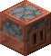
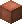
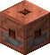
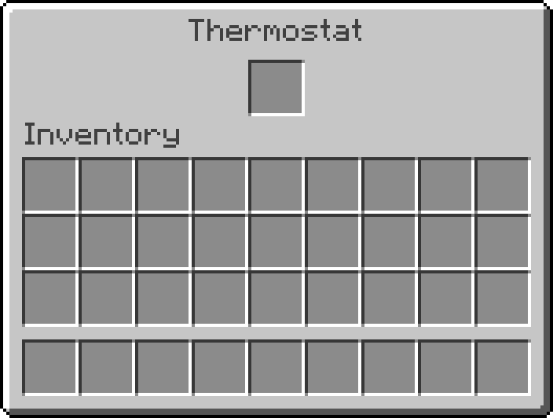

# Heater

**Heater** offers a new way to power **Furnaces**, **Blast Furnaces**, **Smokers**, and [every other machine](#interoperability) that consumes fuel to do some work, even from other mods.

_(Credits to [StarOcean](https://github.com/0Starocean0) for the fantastic textures they created!)_

It does this with only three new blocks: the eponymous **Heater**, the **Heat Pipe**, and the **Thermostat**, each with weathered and waxed variants.

### Heater

As this mod's namesake block, the **Heater** is at the core of this mod and is crafted as follows:

Heater Recipe

At first glance, it looks like a normal furnace-like block—even its screen is very similar to one:

Heater Interface

However, instead of processing items within itself (hence the lack of slots other than the fuel one), it propagates the heat produced by the fuel it burns to nearby blocks, powering every furnace-like block it finds.

### Heat Pipe

As shown in the showcase above, the **Heat Pipe** is, unexpectedly, a pipe through which any **Heater** can propagate the heat it produces, functionally extending that **Heater**'s reach.

It's crafted very easily as follows:

Heat Pipe Recipe

It's also very efficient because it doesn't have an entity, which means you can place many of these pipes without affecting performance.

### Thermostat

Last but not least, the **Thermostat** offers a degree of control over how heat propagates between **Heaters** and furnaces, and across **Heat Pipes**.

It's crafted as follows:

Thermostat Recipe

By default, a **Thermostat** lets heat propagate through itself only if it is redstone-powered, and only in the direction it's facing (the full coppery side).

However, right-clicking a **Thermostat** opens the following screen:

Thermostat Interface

And clicking the central slot with a fuel item sets the **Thermostat** to filtering mode for that fuel. In this mode, when unpowered, this block only propagates heat generated by the filtering fuel, while when powered, it _converts_ the heat it propagates as if it had been generated by the filtering fuel.

Finally, the **Thermostat** is the only block that can propagate heat back into a **Heater**, acting like a heat repeater.

## Interoperability

This mod's _interoperability_, that is, its ability to work with other mods, depends entirely on [**Burning**](https://github.com/NivOridocs/burning), so look there for more details and troubleshooting.
